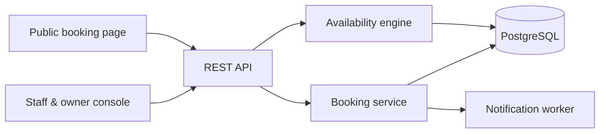

<div align="center">

# Whiteboard

**Multi-tenant booking software for salons and independent service businesses.**

Computed availability across staff and room constraints · timezone-correct through DST · race-free reservation

[](LICENSE)
[](https://openjdk.org/projects/jdk/21/)
[](https://spring.io/projects/spring-boot)
[](https://www.typescriptlang.org/)
[](https://www.postgresql.org/)

[Live demo](#) · [API docs](#) · [Design notes](docs/)

</div>

---

> _screenshot: public booking page_

## Why this exists

A salon in Austria took my booking by writing my name and a time on a whiteboard on the wall.
 
**For the shop, that whiteboard is close to perfect.** No cost, no training, no login, no subscription, and it never goes down. The entire day is legible at a glance and a booking takes three seconds. Most scheduling software is a downgrade for the people who actually work there — more clicks, more fields, more screens between them and the answer they already had on the wall.
 
**For me as the customer, it was the opposite.** I had to be standing in the room to book anything. I couldn't see which times were open without asking someone to read the board for me. I couldn't book at 11pm from my hotel, which is when I actually thought about it. No confirmation to check later, no reminder the day before, and by the following week the board had been wiped — no record I'd ever been there.
 
Those two experiences pull against each other, and most booking products resolve it entirely in the customer's favor while handing the shop a second job. This one tries to keep what the whiteboard does well — the whole day visible at once, a booking in seconds, nothing to learn — and add the part it can't do: a page anyone can open at midnight from another country.

## Engineering highlights

| | |
|---|---|
| **Computed availability** | Bookable times are derived per request by intersecting business hours, staff working hours, approved time off, existing appointments plus buffers, and room conflicts — never pre-generated as slot rows. |
| **Two resource pools** | An in-person service requires a qualified staff member *and* a free room for the full duration. Most booking tools model only one resource per booking. |
| **Deliberate time handling** | Working hours stored as local wall time plus zone ID; appointments in UTC. 2pm remains 2pm across a DST transition, and tenants in different regions do not share a constant offset. |
| **Race-free reservation** | Check-then-insert has a race window. Two concurrent requests for the same slot produce exactly one booking and one clean error. |
| **Structural tenant isolation** | Enforced below the query layer rather than by a `WHERE tenant_id = ?` a developer can forget, with a test proving cross-tenant reads fail. |

Detailed write-ups live in [`docs/`](docs/).

## Architecture



> _screenshot: staff calendar view_

## Tech stack

| Layer | Choice |
|---|---|
| Backend | Java 21, Spring Boot 3, Spring Security, Spring Data JPA |
| Database | PostgreSQL 16 with Flyway migrations |
| Frontend | React 19, TypeScript, Vite, TanStack Query, Tailwind |
| Testing | JUnit 5, Testcontainers |
| Infrastructure | Docker Compose, GitHub Actions, AWS |

## Getting started

**Prerequisites:** JDK 21, Node 20+, Docker

```bash
git clone https://github.com/itsseanez/whiteboard.git
cd whiteboard
cp .env.example .env

docker compose up -d          # PostgreSQL
./gradlew bootRun             # API on :8080

cd frontend
npm install
npm run dev                   # UI on :5173
```

Seed data creates two demo tenants in different timezones.

## Status

In active development since August 2026.

- [ ] Tenancy, authentication, roles, core model, deployed
- [ ] Availability engine
- [ ] Booking flow, public page, concurrency
- [ ] Calendars, reschedule, cancel, notifications, audit trail
- [ ] Hardening, API docs, demo tenants

## License

[MIT](LICENSE)
